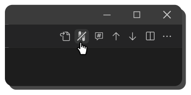

<figure align="center">
    
    <figcaption><b>After opening a diff, click the SemanticDiff icon to switch to a semantic comparison.</b></figcaption>
</figure>

<figure align="center">
    
    <figcaption><b>You can switch back to a regular diff at any time by clicking this symbol.</b></figcaption>
</figure>
