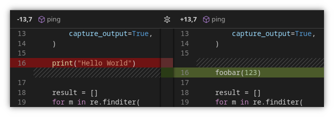
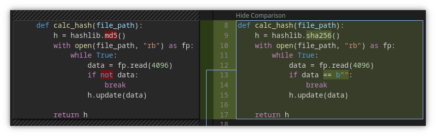

<figure align="center">
    
    <figcaption><b>Removed and added lines are shown with an intense red and green background, respectively.</b></figcaption>
</figure>

 

<figure align="center">
    
    <figcaption><b>If the old and new lines are similar, only the changed section is highlighted.</b></figcaption>
</figure>

 

<figure align="center">
    
    <figcaption><b>Moved code is marked with a box. Moves containing changes can be compared against their original version.</b></figcaption>
</figure>
